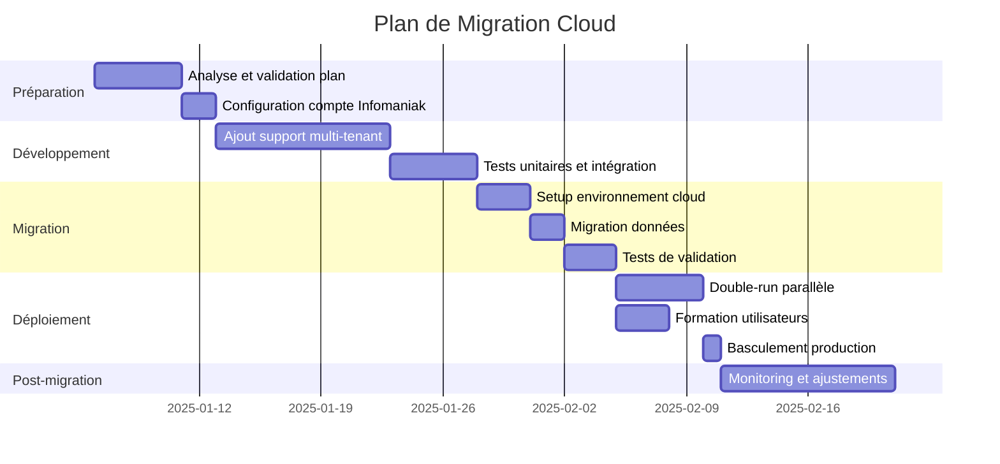

# 📋 SolutionCloud
## Plan de Déploiement Cloud pour l'Application de Gestion des Usagers

**Version :** 1.1
**Date :** 17 décembre 2025
**Destinataires :** Direction
**Statut :** Proposition pour validation

---

## 📌 Résumé Exécutif

### Contexte
L'application de gestion des usagers, actuellement hébergée sur un serveur privé, nécessite une évolution vers une infrastructure cloud pour :
- Garantir la **disponibilité** et la **scalabilité** du service
- Permettre l'**utilisation par d'autres services partenaires** (multi-tenant)
- Assurer la **conformité RGPD** et la **souveraineté des données**
- Réduire la **charge de maintenance** technique

### Proposition
Déploiement sur **Infomaniak Jelastic Cloud** (Suisse) avec une architecture multi-tenant permettant à plusieurs services d'utiliser la même plateforme tout en maintenant une isolation stricte des données.

### Points Clés

| Aspect | Proposition |
|--------|-------------|
| **Hébergeur** | Infomaniak (Suisse) 🇨🇭 |
| **Architecture** | Multi-tenant avec isolation par service |
| **Base de données** | MySQL managé avec séparation logique |
| **Coût estimé** | CHF 30-60/mois (croissant avec les services) |
| **Mise en œuvre** | 4-6 semaines |

---

## 🏗️ Architecture Multi-Service

### Vision Globale

```
┌─────────────────────────────────────────────────────────────────────┐
│                        INFOMANIAK CLOUD (Suisse)                     │
├─────────────────────────────────────────────────────────────────────┤
│                                                                      │
│  ┌─────────────────────────────────────────────────────────────┐    │
│  │                    LOAD BALANCER / HTTPS                     │    │
│  │         (SSL automatique, protection DDoS)                   │    │
│  └─────────────────────────────────────────────────────────────┘    │
│                              │                                       │
│         ┌───────────────────┼───────────────────┐                   │
│         ▼                   ▼                   ▼                   │
│  ┌─────────────┐    ┌─────────────┐    ┌─────────────┐             │
│  │ pasq.app.ch │    │ alpha.app.ch│    │ beta.app.ch │             │
│  │  (Service A)│    │ (Service B) │    │ (Service C) │             │
│  └─────────────┘    └─────────────┘    └─────────────┘             │
│         │                   │                   │                   │
│         └───────────────────┼───────────────────┘                   │
│                             ▼                                        │
│  ┌─────────────────────────────────────────────────────────────┐    │
│  │                    APPLICATION NEXT.JS                       │    │
│  │         (Container Docker avec middleware multi-tenant)      │    │
│  └─────────────────────────────────────────────────────────────┘    │
│                             │                                        │
│                             ▼                                        │
│  ┌─────────────────────────────────────────────────────────────┐    │
│  │                    BASE DE DONNÉES MySQL                     │    │
│  │    ┌──────────┐  ┌──────────┐  ┌──────────┐                 │    │
│  │    │Service A │  │Service B │  │Service C │  (isolation)    │    │
│  │    │  Data    │  │  Data    │  │  Data    │                 │    │
│  │    └──────────┘  └──────────┘  └──────────┘                 │    │
│  └─────────────────────────────────────────────────────────────┘    │
│                                                                      │
│  ┌─────────────────────────────────────────────────────────────┐    │
│  │              STOCKAGE OBJETS (Documents, Backups)            │    │
│  └─────────────────────────────────────────────────────────────┘    │
│                                                                      │
└─────────────────────────────────────────────────────────────────────┘
```

### Stratégies Multi-Service

Trois approches sont possibles pour l'isolation des données entre services :

#### Option A : Base de données unique avec colonne `serviceId` ⭐ Recommandée

```
┌─────────────────────────────────────────┐
│        BASE DE DONNÉES UNIQUE           │
├─────────────────────────────────────────┤
│  Table Users                            │
│  ├── id                                 │
│  ├── serviceId  ← Identifiant service   │
│  ├── nom                                │
│  ├── prenom                             │
│  └── ...                                │
│                                         │
│  Table Settings                         │
│  ├── id                                 │
│  ├── serviceId  ← Identifiant service   │
│  ├── serviceName                        │
│  └── ...                                │
└─────────────────────────────────────────┘
```

| Avantages | Inconvénients |
|-----------|---------------|
| ✅ Coût minimal (une seule DB) | ⚠️ Nécessite middleware de filtrage rigoureux |
| ✅ Maintenance simplifiée | ⚠️ Migrations appliquées à tous les services |
| ✅ Statistiques globales possibles | ⚠️ Risque de fuite si mal implémenté |
| ✅ Déploiement unique | |

**Modifications techniques requises :**
- Ajout d'un champ `serviceId` sur toutes les tables principales
- Création d'un middleware d'authentification injectant le `serviceId`
- Modification de toutes les requêtes API pour filtrer par service

---

#### Option B : Une base de données par service (Isolation maximale)

```
┌──────────────┐  ┌──────────────┐  ┌──────────────┐
│   DB PASQ    │  │  DB ALPHA    │  │   DB BETA    │
├──────────────┤  ├──────────────┤  ├──────────────┤
│  Users       │  │  Users       │  │  Users       │
│  Settings    │  │  Settings    │  │  Settings    │
│  ...         │  │  ...         │  │  ...         │
└──────────────┘  └──────────────┘  └──────────────┘
```

| Avantages | Inconvénients |
|-----------|---------------|
| ✅ Isolation totale des données | ❌ Coût multiplié par service |
| ✅ Chaque service peut personnaliser | ❌ Maintenance DB par service |
| ✅ Pas de risque de fuite | ❌ Migrations à gérer séparément |
| ✅ Conformité RGPD plus simple | ❌ Pas de vue consolidée |

---

#### Recommandation

> [!IMPORTANT]
> Pour votre cas d'usage (services similaires mais distincts), nous recommandons **l'Option A** (base unique avec `serviceId`) pour les raisons suivantes :
> - Réduction significative des coûts
> - Simplicité de maintenance
> - Possibilité de générer des rapports consolidés
> - Évolutivité pour ajouter de nouveaux services rapidement

---

## 🎨 Personnalisation par Service

### Principe Fondamental

> [!IMPORTANT]
> Chaque service partenaire a des besoins spécifiques tout en partageant un socle commun. L'architecture permet une **personnalisation sans duplication de code** grâce à un système de configuration dynamique.

### Niveaux de Personnalisation

```
┌─────────────────────────────────────────────────────────────────────────┐
│                    PYRAMIDE DE PERSONNALISATION                         │
├─────────────────────────────────────────────────────────────────────────┤
│                                                                          │
│  NIVEAU 4 : CHAMPS PERSONNALISÉS (Rare)                                 │
│  └── Champs entièrement nouveaux propres à un service                   │
│      Exemple: "numéroCAF" pour un service spécifique                    │
│                                                                          │
│  ──────────────────────────────────────────────────────────────────     │
│                                                                          │
│  NIVEAU 3 : MODULES ACTIVABLES (Fréquent)                               │
│  └── Fonctionnalités complètes on/off par service                       │
│      Exemples: Prévention Expulsion, Dashboard, Attestation RGPD       │
│                                                                          │
│  ──────────────────────────────────────────────────────────────────     │
│                                                                          │
│  NIVEAU 2 : CONFIGURATION FORMULAIRE (Très fréquent)                    │
│  └── Champs visibles/masqués, obligatoires, labels personnalisés       │
│      Exemple: Masquer "secteur géographique" pour un service           │
│                                                                          │
│  ──────────────────────────────────────────────────────────────────     │
│                                                                          │
│  NIVEAU 1 : BRANDING (Systématique)                                     │
│  └── Logo, couleurs, nom du service, sous-domaine                      │
│      Exemple: pasq.app.ch vs alpha.app.ch                               │
│                                                                          │
└─────────────────────────────────────────────────────────────────────────┘
```

### Éléments Personnalisables par Service

| Élément | Type | Exemple PASQ | Exemple Service B |
|---------|------|--------------|-------------------|
| **Logo** | Branding | Logo PASQ | Logo Service B |
| **Couleur primaire** | Branding | Bleu #1e3a8a | Vert #166534 |
| **Nom affiché** | Branding | "PASQ" | "Antenne Sud" |
| **Module PrevExp** | Module | ✅ Activé | ❌ Désactivé |
| **Module Logement** | Module | ✅ Activé | ✅ Activé |
| **Dashboard** | Module | ✅ Activé | ✅ Activé |
| **Champ "antenne"** | Formulaire | ✅ Visible | ❌ Masqué |
| **Champ "nationalité"** | Formulaire | Optionnel | Obligatoire |
| **Options gestionnaires** | Dropdown | Liste PASQ | Liste Service B |
| **Secteurs géographiques** | Dropdown | Quartiers Bruxelles | Zones propres |

### Implémentation Technique

#### Modèle de Configuration par Service

```prisma
model ServiceConfig {
  id              String   @id @default(uuid())
  serviceId       String   @unique
  service         Service  @relation(fields: [serviceId], references: [id])

  // ═══════════════════════════════════════════════════════
  // MODULES ACTIVABLES
  // ═══════════════════════════════════════════════════════
  enablePrevExp       Boolean  @default(true)   // Module Prévention Expulsion
  enableLogement      Boolean  @default(true)   // Module Logement
  enableDashboard     Boolean  @default(true)   // Analytics
  enableRgpdAttest    Boolean  @default(true)   // Attestation RGPD
  enableAnniversaires Boolean  @default(false)  // Anniversaires

  // ═══════════════════════════════════════════════════════
  // PERSONNALISATION FORMULAIRE
  // ═══════════════════════════════════════════════════════
  hiddenFields    Json     @default("[]")   // Champs à masquer
  requiredFields  Json     @default("[]")   // Champs obligatoires
  customLabels    Json     @default("{}")   // Labels personnalisés

  // ═══════════════════════════════════════════════════════
  // PERSONNALISATION WORKFLOW
  // ═══════════════════════════════════════════════════════
  customStatuses  Json     @default("[]")   // États dossier personnalisés
  customActions   Json     @default("[]")   // Types d'actions personnalisés

  createdAt       DateTime @default(now())
  updatedAt       DateTime @updatedAt

  @@map("service_configs")
}
```

#### Exemple de Configuration JSON

```json
{
  "serviceId": "pasq-001",
  "serviceName": "PASQ - Pôle Accueil Social des Quartiers",

  "modules": {
    "preventionExpulsion": true,
    "logement": true,
    "dashboard": true,
    "rgpdAttestation": true
  },

  "formulaire": {
    "hiddenFields": [],
    "requiredFields": ["nom", "prenom", "dateNaissance", "telephone"],
    "customLabels": {
      "antenne": "Antenne PASQ"
    }
  }
}
```

```json
{
  "serviceId": "alpha-001",
  "serviceName": "Service Alpha - Aide au Logement",

  "modules": {
    "preventionExpulsion": false,
    "logement": true,
    "dashboard": true,
    "rgpdAttestation": false
  },

  "formulaire": {
    "hiddenFields": ["prevExpCommentaire", "prevExpDateReception", "antenne"],
    "requiredFields": ["nom", "prenom", "telephone", "email"],
    "customLabels": {
      "secteur": "Zone d'intervention"
    }
  }
}
```

### Interface d'Administration

Chaque SERVICE_ADMIN pourra configurer son service via une interface dédiée :

```
┌─────────────────────────────────────────────────────────────────────────┐
│  ⚙️ PARAMÈTRES DU SERVICE                          [Service Alpha]     │
├─────────────────────────────────────────────────────────────────────────┤
│                                                                          │
│  BRANDING                                                               │
│  ┌─────────────────────────────────────────────────────────────────┐   │
│  │  Logo: [Télécharger]                                             │   │
│  │  Nom affiché: [Service Alpha________________]                   │   │
│  │  Couleur primaire: [#166534] 🟢                                 │   │
│  └─────────────────────────────────────────────────────────────────┘   │
│                                                                          │
│  MODULES                                                                 │
│  ┌─────────────────────────────────────────────────────────────────┐   │
│  │  ☑ Module Logement                                               │   │
│  │  ☑ Dashboard Analytics                                           │   │
│  │  ☐ Prévention Expulsion                                          │   │
│  │  ☐ Attestation RGPD                                              │   │
│  └─────────────────────────────────────────────────────────────────┘   │
│                                                                          │
│  CHAMPS DU FORMULAIRE                                                   │
│  ┌─────────────────────────────────────────────────────────────────┐   │
│  │  Champ              │ Visible │ Obligatoire │ Label personnalisé │   │
│  │  ─────────────────────────────────────────────────────────────  │   │
│  │  Nom                │  ✅     │     ✅      │ [Nom__________]   │   │
│  │  Prénom             │  ✅     │     ✅      │ [Prénom_______]   │   │
│  │  Téléphone          │  ✅     │     ✅      │ [______________]  │   │
│  │  Antenne            │  ❌     │     ❌      │ [______________]  │   │
│  │  Secteur            │  ✅     │     ❌      │ [Zone intervention]│   │
│  └─────────────────────────────────────────────────────────────────┘   │
│                                                                          │
│                                        [Annuler]  [💾 Enregistrer]      │
└─────────────────────────────────────────────────────────────────────────┘
```

### Ce qui Reste Commun à Tous les Services

| Élément | Raison |
|---------|--------|
| **Code source** | Une seule base de code à maintenir |
| **Mises à jour** | Tous les services bénéficient des nouvelles fonctionnalités |
| **Sécurité** | Correctifs appliqués uniformément |
| **Infrastructure** | Économies d'échelle |
| **Support technique** | Centralisation de l'expertise |

### Effort de Développement Estimé

| Fonctionnalité | Complexité | Durée estimée |
|----------------|------------|---------------|
| Système de configuration par service | Moyenne | 3-4 jours |
| Interface admin de personnalisation | Moyenne | 4-5 jours |
| Modules activables (feature flags) | Faible | 2-3 jours |
| Champs masquables/obligatoires | Faible | 1-2 jours |
| Labels personnalisables | Faible | 1 jour |
| **Total** | | **~2 semaines** |

---

## 🔐 Sécurité et Conformité

### Conformité RGPD

L'application traite des **données personnelles sensibles** (dossiers sociaux). Voici les mesures de conformité :

| Exigence RGPD | Mesure Implémentée | Statut |
|--------------|--------------------|--------|
| **Article 5 - Minimisation** | Collecte uniquement des données nécessaires | ✅ En place |
| **Article 17 - Droit à l'effacement** | Fonction de suppression de dossier | ✅ En place |
| **Article 25 - Privacy by design** | Champs `donneesConfidentielles` masqués par défaut | ✅ En place |
| **Article 30 - Registre des traitements** | À documenter formellement | ⚠️ À créer |
| **Article 32 - Sécurité** | Chiffrement, authentification, audit | ✅ Partiellement |
| **Article 33 - Notification de violation** | Procédure à définir | ⚠️ À créer |

### Stratégie d'Archivage et Rétention des Données

> [!IMPORTANT]
> Une stratégie d'archivage automatisée garantit la conformité RGPD sans intervention manuelle.

#### Architecture de Gestion des Données par Année

```
┌─────────────────────────────────────────────────────────────────────────┐
│                    CYCLE DE VIE DES DONNÉES                             │
├─────────────────────────────────────────────────────────────────────────┤
│                                                                          │
│  BASE ACTIVE (consultation quotidienne)                                 │
│  ┌──────────────────────────────────────────────────────────────────┐   │
│  │  Table: users                                                     │   │
│  │  Années: N et N-1 (ex: 2024-2025)                                │   │
│  │  Performance: Optimale                                            │   │
│  └──────────────────────────────────────────────────────────────────┘   │
│                              │                                           │
│                              ▼ Archivage automatique (1er janvier)       │
│  ARCHIVE (consultation rare)                                            │
│  ┌──────────────────────────────────────────────────────────────────┐   │
│  │  Table: users_archive                                             │   │
│  │  Années: N-2 à N-5 (ex: 2020-2023)                               │   │
│  │  Accès: Lecture seule                                             │   │
│  └──────────────────────────────────────────────────────────────────┘   │
│                              │                                           │
│                              ▼ Purge automatique (après 5 ans)          │
│  SUPPRESSION CONFORME RGPD                                              │
│  ┌──────────────────────────────────────────────────────────────────┐   │
│  │  Données > 5 ans : supprimées définitivement                     │   │
│  │  Log de suppression conservé pour audit                          │   │
│  └──────────────────────────────────────────────────────────────────┘   │
│                                                                          │
└─────────────────────────────────────────────────────────────────────────┘
```

#### Procédure Annuelle Automatisée

| Étape | Action | Fréquence |
|-------|--------|-----------|
| 1 | Archivage des dossiers de N-2 vers `users_archive` | 1er janvier |
| 2 | Suppression des dossiers archivés > 5 ans | 1er janvier |
| 3 | Génération du rapport de conformité | 1er janvier |
| 4 | Notification à l'administrateur | Automatique |

#### Avantages de Cette Approche

| Aspect | Bénéfice |
|--------|----------|
| **RGPD** | Suppression automatique sans intervention |
| **Performance** | Base active légère (2 années max) |
| **Historique** | Accès aux archives si nécessaire |
| **Audit** | Logs de suppression pour prouver la conformité |
| **Code** | Aucune modification de la structure Prisma |

### Avantage Infomaniak (Suisse)

> [!NOTE]
> La Suisse bénéficie d'une **décision d'adéquation** de la Commission Européenne, ce qui signifie que le transfert de données vers la Suisse est légal et ne nécessite pas de clauses contractuelles supplémentaires.

| Aspect | Garantie |
|--------|----------|
| **CLOUD Act** | ❌ Non applicable (entreprise 100% suisse) |
| **LPD (Loi suisse)** | Protection équivalente ou supérieure au RGPD |
| **Localisation** | Données 100% en Suisse, jamais externalisées |
| **Certification** | ISO 27001, ISO 14001 |

### Mesures de Sécurité Techniques

```
┌─────────────────────────────────────────────────────────────────────┐
│                        COUCHES DE SÉCURITÉ                          │
├─────────────────────────────────────────────────────────────────────┤
│                                                                      │
│  1. RÉSEAU                                                          │
│     ├── Pare-feu applicatif (WAF)                                   │
│     ├── Protection DDoS                                             │
│     └── HTTPS obligatoire (TLS 1.3)                                 │
│                                                                      │
│  2. APPLICATION                                                      │
│     ├── Authentification NextAuth (sessions sécurisées)             │
│     ├── Middleware de contrôle d'accès par service                  │
│     ├── Validation des entrées (sanitization)                       │
│     └── Headers de sécurité (CSP, HSTS, X-Frame-Options)            │
│                                                                      │
│  3. DONNÉES                                                          │
│     ├── Chiffrement au repos (TDE MySQL)                            │
│     ├── Chiffrement en transit (TLS)                                │
│     ├── Hashing des mots de passe (bcrypt)                          │
│     └── Logs d'audit (createdBy, updatedBy, timestamps)             │
│                                                                      │
│  4. SAUVEGARDE                                                       │
│     ├── Backup automatique quotidien                                │
│     ├── Rétention 30 jours                                          │
│     └── Stockage géographiquement séparé                            │
│                                                                      │
└─────────────────────────────────────────────────────────────────────┘
```

### Gestion des Accès Multi-Service

```
┌─────────────────────────────────────────────────────────────────────┐
│                     MODÈLE D'AUTORISATION                           │
├─────────────────────────────────────────────────────────────────────┤
│                                                                      │
│  RÔLES PAR SERVICE                                                  │
│  ┌─────────────────────────────────────────────────────────────┐    │
│  │  SUPER_ADMIN    │ Accès à tous les services (administration) │    │
│  │  SERVICE_ADMIN  │ Admin d'un service spécifique              │    │
│  │  GESTIONNAIRE   │ Gestion des dossiers de son service        │    │
│  │  LECTEUR        │ Consultation seule                         │    │
│  └─────────────────────────────────────────────────────────────┘    │
│                                                                      │
│  ISOLATION DES DONNÉES                                              │
│  ┌─────────────────────────────────────────────────────────────┐    │
│  │  • Un gestionnaire PASQ ne voit QUE les dossiers PASQ       │    │
│  │  • Un admin PASQ ne peut pas modifier les settings d'ALPHA  │    │
│  │  • Seul le SUPER_ADMIN peut créer de nouveaux services      │    │
│  └─────────────────────────────────────────────────────────────┘    │
│                                                                      │
└─────────────────────────────────────────────────────────────────────┘
```

---

## 🗄️ Infrastructure et Base de Données

### Stack Technique Actuelle

| Composant | Technologie | Version |
|-----------|-------------|---------|
| **Frontend** | Next.js | 14.1.4 |
| **UI** | React + TailwindCSS | 18.3.1 |
| **Backend** | Next.js API Routes | 14.1.4 |
| **ORM** | Prisma | 6.6.0 |
| **Base de données** | MySQL | 8.x |
| **Authentification** | NextAuth.js | 4.24.11 |
| **Conteneurisation** | Docker | ✅ Dockerfile existant |

### Configuration Cloud Proposée

#### Environnement Infomaniak Jelastic

```
┌─────────────────────────────────────────────────────────────────────┐
│                    ENVIRONNEMENT JELASTIC                           │
├─────────────────────────────────────────────────────────────────────┤
│                                                                      │
│  ┌─────────────────────────────────────────────────────────────┐    │
│  │  NŒUD APPLICATION                                            │    │
│  │  ├── Docker Engine                                           │    │
│  │  ├── Image: gestion-usagers:latest                          │    │
│  │  ├── Ressources: 2 vCPU, 4GB RAM (scalable)                │    │
│  │  └── Autoscaling: activé (0.5-4 cloudlets)                  │    │
│  └─────────────────────────────────────────────────────────────┘    │
│                              │                                       │
│                              ▼                                       │
│  ┌─────────────────────────────────────────────────────────────┐    │
│  │  NŒUD BASE DE DONNÉES                                        │    │
│  │  ├── MySQL 8.0 Managé                                        │    │
│  │  ├── Ressources: 2 vCPU, 4GB RAM                            │    │
│  │  ├── Stockage: 50GB SSD (extensible)                        │    │
│  │  └── Backups: automatiques quotidiens                       │    │
│  └─────────────────────────────────────────────────────────────┘    │
│                              │                                       │
│                              ▼                                       │
│  ┌─────────────────────────────────────────────────────────────┐    │
│  │  STOCKAGE OBJETS (optionnel)                                 │    │
│  │  ├── Swiss Object Storage (S3-compatible)                   │    │
│  │  ├── Pour: documents, exports, backups                      │    │
│  │  └── Capacité: selon besoins                                │    │
│  └─────────────────────────────────────────────────────────────┘    │
│                                                                      │
└─────────────────────────────────────────────────────────────────────┘
```

### Stratégie de Migration Base de Données

```
┌─────────────────────────────────────────────────────────────────────┐
│                    PLAN DE MIGRATION                                │
├─────────────────────────────────────────────────────────────────────┤
│                                                                      │
│  ÉTAPE 1: Préparation (Semaine 1)                                   │
│  ├── Export de la base actuelle (mysqldump)                        │
│  ├── Anonymisation des données de test                             │
│  └── Validation du schéma Prisma                                    │
│                                                                      │
│  ÉTAPE 2: Mise à jour du schéma (Semaine 2)                         │
│  ├── Ajout de la colonne serviceId sur toutes les tables           │
│  ├── Création de la table Service                                   │
│  ├── Migration Prisma + tests                                       │
│  └── Rétro-population du serviceId pour données existantes          │
│                                                                      │
│  ÉTAPE 3: Déploiement Cloud (Semaine 3)                             │
│  ├── Création de l'environnement Infomaniak                        │
│  ├── Import des données                                             │
│  ├── Configuration des variables d'environnement                    │
│  └── Tests de validation                                            │
│                                                                      │
│  ÉTAPE 4: Basculement (Semaine 4)                                   │
│  ├── Période de double-run (parallèle)                              │
│  ├── Validation utilisateurs                                        │
│  ├── Basculement DNS                                                │
│  └── Décommissionnement ancien serveur                              │
│                                                                      │
└─────────────────────────────────────────────────────────────────────┘
```

### Modifications du Schéma Prisma

Voici les changements nécessaires pour le multi-service :

```prisma
// Nouveau modèle Service
model Service {
  id           String        @id @default(uuid())
  nom          String
  subdomain    String        @unique  // pasq, alpha, beta
  logoUrl      String?
  primaryColor String        @default("#1e3a8a")
  isActive     Boolean       @default(true)
  createdAt    DateTime      @default(now())
  updatedAt    DateTime      @updatedAt

  // Relations
  users        User[]
  gestionnaires Gestionnaire[]
  settings     Settings?

  @@map("services")
}

// Modification du modèle User
model User {
  id         String   @id
  serviceId  String   // ← NOUVEAU
  service    Service  @relation(fields: [serviceId], references: [id])
  // ... autres champs existants

  @@index([serviceId])
}

// Modification du modèle Gestionnaire
model Gestionnaire {
  id         String   @id @default(uuid())
  serviceId  String   // ← NOUVEAU
  service    Service  @relation(fields: [serviceId], references: [id])
  // ... autres champs existants

  @@index([serviceId])
}

// Modification du modèle Settings
model Settings {
  id         String   @id @default(uuid())
  serviceId  String   @unique // ← NOUVEAU (un settings par service)
  service    Service  @relation(fields: [serviceId], references: [id])
  // ... autres champs existants
}
```

---

## 💰 Analyse des Coûts

### Coûts Mensuels Estimés

#### Scénario 1 : Service Unique (PASQ seul)

| Composant | Spécifications | Coût/mois |
|-----------|----------------|-----------|
| Application Docker | 2 vCPU, 4GB RAM | CHF 15-20 |
| MySQL Managé | 2 vCPU, 4GB RAM, 50GB | CHF 10-15 |
| Stockage objet | 10GB | CHF 0.50 |
| SSL / Domaine | Inclus | CHF 0 |
| Backups | Inclus | CHF 0 |
| **Total** | | **CHF 25-35/mois** |

#### Scénario 2 : Multi-Service (3 services)

| Composant | Spécifications | Coût/mois |
|-----------|----------------|-----------|
| Application Docker | 4 vCPU, 8GB RAM (scaling) | CHF 30-45 |
| MySQL Managé | 4 vCPU, 8GB RAM, 100GB | CHF 20-30 |
| Stockage objet | 30GB | CHF 1.50 |
| Domaines additionnels | 2 sous-domaines | CHF 0 |
| **Total** | | **CHF 50-75/mois** |

#### Scénario 3 : Multi-Service avec DB séparées

| Composant | Spécifications | Coût/mois |
|-----------|----------------|-----------|
| Application Docker | 4 vCPU, 8GB RAM | CHF 30-45 |
| MySQL Managé x3 | 3 instances | CHF 45-60 |
| Stockage objet | 30GB | CHF 1.50 |
| **Total** | | **CHF 75-105/mois** |

### Comparatif avec Situation Actuelle

| Aspect | Serveur Privé | Cloud Infomaniak |
|--------|---------------|------------------|
| **Coût matériel** | Amortissement serveur | CHF 0 |
| **Électricité** | À votre charge | Inclus |
| **Maintenance système** | Votre temps | Inclus |
| **Mises à jour sécurité** | Manuel | Automatique |
| **Disponibilité** | Dépend de votre infra | 99.9% SLA |
| **Scalabilité** | Limitée | Automatique |
| **Disaster Recovery** | À configurer | Inclus |

### Répartition des Coûts entre Services

Si plusieurs services utilisent la plateforme :

| Modèle | Description |
|--------|-------------|
| **Coût partagé fixe** | Chaque service paie 1/N du total |
| **Coût au prorata** | Selon le nombre d'utilisateurs/dossiers |
| **Coût échelonné** | Tarif dégressif selon l'usage |

---

## 📅 Planning de Mise en Œuvre

### Roadmap de Migration



### Phases Détaillées

#### Phase 1 : Préparation (Semaine 1)
- [ ] Validation du plan par la direction
- [ ] Création du compte Infomaniak
- [ ] Configuration initiale de l'environnement Jelastic
- [ ] Setup du repository Git connecté

#### Phase 2 : Développement Multi-Tenant (Semaines 2-3)
- [ ] Modification du schéma Prisma (ajout `serviceId`)
- [ ] Création du middleware d'isolation par service
- [ ] Adaptation des API routes
- [ ] Modification du système d'authentification
- [ ] Tests automatisés

#### Phase 3 : Migration (Semaine 4)
- [ ] Export des données actuelles
- [ ] Import dans l'environnement cloud
- [ ] Configuration des variables d'environnement
- [ ] Tests de validation fonctionnelle
- [ ] Tests de charge

#### Phase 4 : Déploiement (Semaine 5)
- [ ] Période de double-run (ancien + nouveau)
- [ ] Formation des utilisateurs
- [ ] Basculement DNS
- [ ] Monitoring intensif

#### Phase 5 : Onboarding Services (Semaine 6+)
- [ ] Configuration du premier service partenaire
- [ ] Documentation utilisateur par service
- [ ] Support et ajustements

---

## ⚠️ Analyse des Risques

### Risques Identifiés et Mitigations

| Risque | Probabilité | Impact | Mitigation |
|--------|-------------|--------|------------|
| **Perte de données lors de la migration** | Faible | Critique | Sauvegardes multiples avant migration, validation post-import |
| **Fuite de données entre services** | Moyenne | Critique | Middleware de filtrage rigoureux, tests de sécurité, audits |
| **Indisponibilité prolongée** | Faible | Élevé | Double-run pendant la transition, rollback plan |
| **Dépassement de coûts** | Moyenne | Modéré | Alertes budgétaires, monitoring de l'usage |
| **Résistance au changement** | Moyenne | Modéré | Formation, documentation, support renforcé |
| **Problèmes de performance** | Faible | Modéré | Tests de charge, auto-scaling configuré |

### Plan de Rollback

En cas de problème majeur :

```
┌─────────────────────────────────────────────────────────────────────┐
│                      PROCÉDURE DE ROLLBACK                          │
├─────────────────────────────────────────────────────────────────────┤
│                                                                      │
│  1. DÉTECTION DU PROBLÈME                                           │
│     └── Alertes automatiques ou signalement utilisateur             │
│                                                                      │
│  2. DÉCISION DE ROLLBACK                                            │
│     └── Si impact > 30 minutes ou données corrompues               │
│                                                                      │
│  3. EXÉCUTION                                                        │
│     ├── Basculement DNS vers ancien serveur (< 5 min)              │
│     ├── Restauration dernière sauvegarde valide                    │
│     └── Communication aux utilisateurs                              │
│                                                                      │
│  4. ANALYSE POST-INCIDENT                                           │
│     ├── Identification de la cause racine                          │
│     ├── Correction et tests                                         │
│     └── Nouvelle tentative planifiée                                │
│                                                                      │
└─────────────────────────────────────────────────────────────────────┘
```

---

## ✅ Recommandations

### Actions Prioritaires

> [!IMPORTANT]
> **Décisions requises avant de commencer :**
>
> 1. **Validation du budget** : CHF 30-60/mois pour l'infrastructure cloud
> 2. **Choix de l'architecture multi-tenant** : Base unique (recommandé) ou bases séparées
> 3. **Identification des services partenaires** : Qui utilisera la plateforme et quand ?
> 4. **Désignation d'un super-administrateur** : Pour la gestion globale de la plateforme

### Prochaines Étapes Proposées

1. **Immédiat** : Valider ce plan de déploiement
2. **Semaine 1** : Créer le compte Infomaniak et l'environnement de test
3. **Semaines 2-3** : Développer les fonctionnalités multi-tenant
4. **Semaine 4** : Migrer vers le cloud en mode test
5. **Semaine 5** : Basculement en production
6. **Semaine 6+** : Onboarding des services partenaires

### Bénéfices Attendus

| Bénéfice | Description |
|----------|-------------|
| **Disponibilité** | 99.9% de disponibilité garantie (SLA) |
| **Scalabilité** | Ajout de nouveaux services sans modification d'infrastructure |
| **Sécurité** | Conformité RGPD + protection données en Suisse |
| **Maintenance** | Réduction du temps de maintenance technique |
| **Évolutivité** | Facilité d'ajout de nouvelles fonctionnalités |
| **Collaboration** | Possibilité de mutualisation entre services |

### Focus : Scalabilité - Ajouter un Service en 30 Minutes

L'architecture multi-tenant permet d'ajouter un nouveau service partenaire **sans aucune modification d'infrastructure** :

#### Comparaison des Approches

| Aspect | ❌ Sans multi-tenant | ✅ Avec multi-tenant |
|--------|---------------------|----------------------|
| **Nouveau service** | Nouveau serveur + DB + déploiement | Nouvelle ligne en base |
| **Temps** | 1-2 semaines | 30 minutes |
| **Coût additionnel** | +CHF 30-50/mois | ~CHF 2-5/mois |
| **Maintenance** | Instance supplémentaire à gérer | Aucune charge |

#### Procédure d'Ajout d'un Service

```
┌─────────────────────────────────────────────────────────────────────────┐
│           AJOUTER "SERVICE DELTA" EN 3 ÉTAPES                           │
├─────────────────────────────────────────────────────────────────────────┤
│                                                                          │
│  ÉTAPE 1 : Créer le service (5 min)                                     │
│  └── INSERT INTO services (nom, subdomain, primaryColor)                │
│      VALUES ('Service Delta', 'delta', '#7c3aed');                      │
│                                                                          │
│  ÉTAPE 2 : Créer l'admin du service (5 min)                             │
│  └── INSERT INTO gestionnaires (nom, email, serviceId, role)           │
│      VALUES ('Admin Delta', 'admin@delta.be', 'delta', 'SERVICE_ADMIN');│
│                                                                          │
│  ÉTAPE 3 : Configurer le DNS (20 min)                                   │
│  └── delta.votreapp.ch → même serveur que les autres services          │
│                                                                          │
│  ✅ TERMINÉ : delta.votreapp.ch est opérationnel !                      │
│                                                                          │
└─────────────────────────────────────────────────────────────────────────┘
```

#### Impact pour la Direction

- **Économies d'échelle** : Plus de services = coût par service réduit
- **Time-to-market** : Nouveau partenaire opérationnel en quelques heures
- **Zéro risque technique** : Aucun nouveau serveur à configurer ou maintenir

---

## 📎 Annexes

### A. Contacts Infomaniak
- **Site** : [infomaniak.com](https://www.infomaniak.com)
- **Support** : +41 22 820 35 40 (français)
- **Documentation Jelastic** : [docs.infomaniak.cloud](https://docs.infomaniak.cloud)

### B. Ressources Techniques
- Documentation Prisma : [prisma.io/docs](https://www.prisma.io/docs)
- Guide Multi-tenancy Next.js : [nextjs.org/docs](https://nextjs.org/docs)

### C. Checklist RGPD
- [ ] Registre des traitements documenté
- [ ] Politique de confidentialité mise à jour
- [ ] Contrat de sous-traitance avec Infomaniak
- [ ] Procédure de gestion des violations
- [ ] Formation équipes sur la protection des données

---

**Document préparé par** : Équipe Technique
**Pour validation par** : Direction
**Date limite de décision** : À définir

---

> [!NOTE]
> Ce document est une proposition technique et financière. Les coûts indiqués sont des estimations basées sur les tarifs publics d'Infomaniak et peuvent varier selon l'usage réel.
